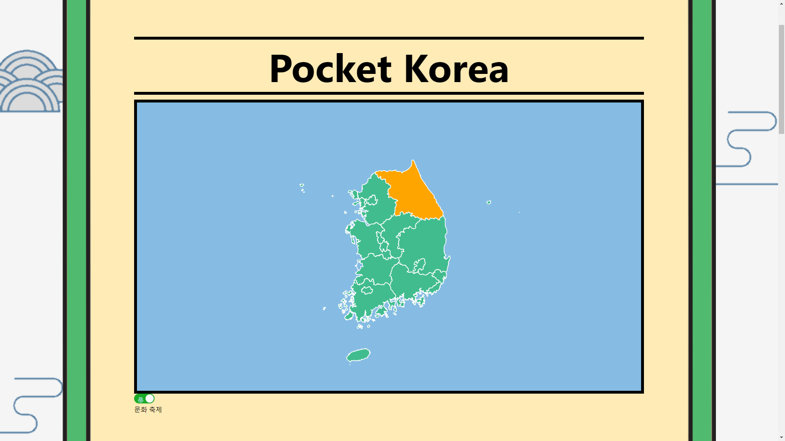
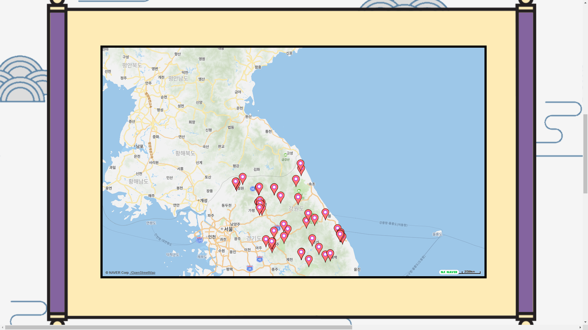
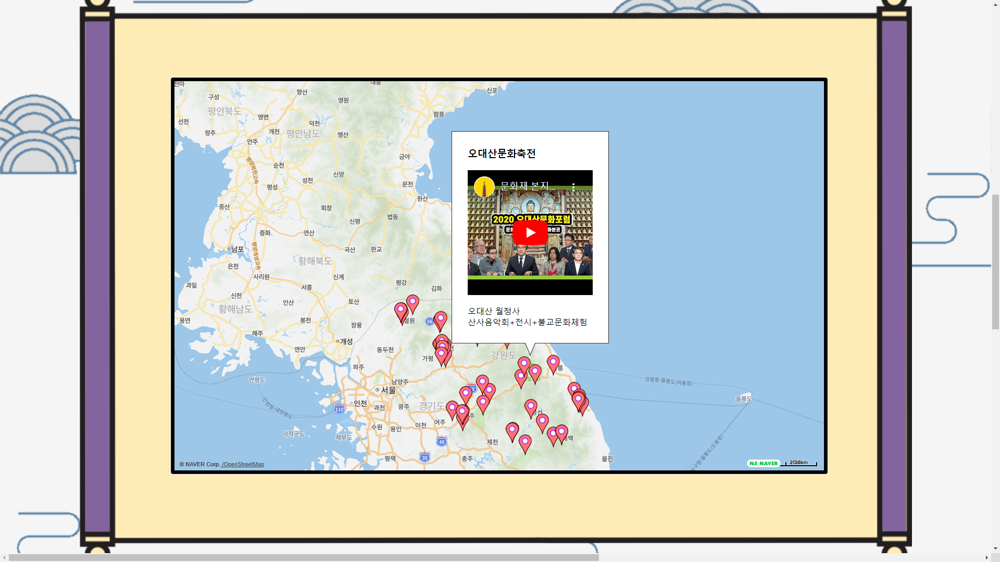
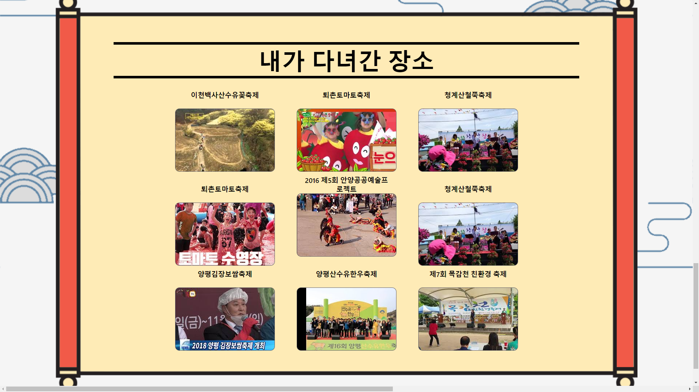

# Pocket Korea🛫
코로나로 인한 **관광업 매출 하락**😱  
코로나 블루로 인한 **우울증 증가**😩  

## 언택트 코리아 여행 서비스
한국의 여러 관광 공공데이터와 유튜브를 이용해 한국을 여행합시다! 
```
언택트 여행으로 화이팅하고, 코로나 끝나고 꼭 가자!!!🚀
``` 

---

## 사용법

1. 전국의 광역시/도가 표시된 지도에서 둘러볼 지역을 클릭하세요.  
    ```
    💡토글 스위치를 이용해 문화 축제와 관광지를 찾을 수 있습니다!
    ```
    
2. 지도상에서 둘러볼 축제나 관광지를 선택하세요.  
    
3. 마커를 클릭 시, 간략한 행사 정보와 함께 youtube를 통해 축제 영상을 관람 가능합니다!
    
4. 지금까지 둘러본 관광지 내역을 볼 수 있습니다.
    

---

## Contributors - 영원휘이😎
정재영(J-jaeyoung) 송준영(hamBP) 김진원(xmcodings) 노휘인(nohwiin) 조이(Lemontrace)

## 기술 스택📚
벡엔드 서버 구현 : flask  
프론트엔드 서버 구현 : react.js  
데이터 처리 : ruby

## 사용 공공 데이터📰
- 전국 문화축제 : [https://www.data.go.kr/data/15013104/standard.do](https://www.data.go.kr/data/15013104/standard.do)
- 전국관광지정보표준데이터 : [https://www.data.go.kr/data/15021141/standard.do](https://www.data.go.kr/data/15021141/standard.do)
    
